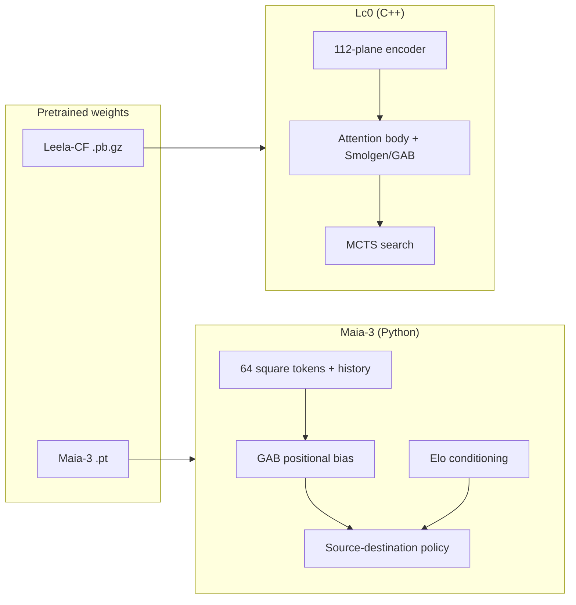

# Chessformer Integration

This repository is an [Lc0](https://github.com/LeelaChessZero/lc0) fork for the
[Chessformer](https://arxiv.org/abs/2605.19091) unified chess modeling
architecture. Chessformer advances engine strength, human move prediction, and
interpretability with a single encoder-only transformer design that treats board
squares as tokens and uses Geometric Attention Bias (GAB) for domain-aware
attention.

The paper open-sources two complementary runtimes:

| Component | Purpose | Runtime | Weights |
| --- | --- | --- | --- |
| **Lc0 (this repo)** | Maximum playing strength with search | C++ UCI engine + MCTS | Leela-CF / BT4 `.pb.gz` from [LeelaChessZero on Hugging Face](https://huggingface.co/LeelaChessZero) |
| **Maia-3 (`maia3/`)** | Human move prediction across skill levels | Python UCI engine (PyTorch) | Maia-3 `.pt` from [MaiaChess on Hugging Face](https://huggingface.co/collections/MaiaChess/maia3) |

Both share the Chessformer architecture (64 square tokens, GAB, source-destination
policy head). Lc0 implements the engine variant with Smolgen (equivalent to GAB)
in its attention-body backends; Maia-3 adds Elo conditioning for human modeling.

## Quick Start

### 1. Build Lc0 (engine strength)

```bash
# On this cloud VM, use gcc — the default clang fails with "cannot find -lstdc++".
CC=gcc CXX=g++ ./build.sh
```

Download a Chessformer engine network (for example Leela-CF / BT4) and run:

```bash
./build/release/lc0 --weights=BT4.pb.gz --backend=blas
```

Use full search for strength (`go nodes 160000` or similar). See the upstream
[Lc0 README](README.md) for backend options (CUDA, ONNX, etc.).

### 2. Install Maia-3 (human move prediction)

```bash
./scripts/setup-maia3.sh
maia3-cache --model maia3-5m
maia3-5m
```

Add `maia3-5m`, `maia3-23m`, or `maia3-79m` as a UCI engine in your chess GUI.
Maia-3 performs a single forward pass (no search). Set UCI options `SelfElo` and
`OppoElo` to match the skill level you want to emulate.

For programmatic use:

```python
import chess
import chess.engine

with chess.engine.SimpleEngine.popen_uci(["maia3-5m"]) as eng:
    eng.configure({"SelfElo": 1500, "OppoElo": 1500})
    result = eng.play(chess.Board(), chess.engine.Limit(nodes=1))
    print(result.move)
```

See [`maia3/README.md`](maia3/README.md) for full Maia-3 documentation.

## Architecture Overview



### Key differences

| Aspect | Lc0 Chessformer | Maia-3 |
| --- | --- | --- |
| Weight format | Protobuf `.pb.gz` | PyTorch `.pt` |
| Input encoding | 112 planes + metadata | 8×12 one-hot frames + Elo embeddings |
| Positional bias | Smolgen (shared GAB weights) | GAB (`gab_*` in checkpoints) |
| Search | MCTS (100k+ nodes) | None (policy head only) |
| Skill conditioning | No | SelfElo / OppoElo UCI options |
| Primary use | Engine tournaments, analysis | Human-like play, coaching, research |

## Updating the Maia-3 Submodule

```bash
git submodule update --init --recursive
cd maia3 && git fetch && git checkout main && git pull
cd .. && git add maia3 && git commit -m "Update maia3 submodule"
pip install ./maia3
```

## References

- Paper: [Chessformer: A Unified Architecture for Chess Modeling](https://arxiv.org/abs/2605.19091) (ICLR 2026)
- Maia-3 code: [CSSLab/maia3](https://github.com/CSSLab/maia3) (vendored in `maia3/`)
- Legacy Maia: [CSSLab/maia-chess](https://github.com/CSSLab/maia-chess)
- Lc0 upstream: [LeelaChessZero/lc0](https://github.com/LeelaChessZero/lc0)

If you use this work, please cite:

```bibtex
@inproceedings{monroe2026chessformer,
  title={Chessformer: A Unified Architecture for Chess Modeling},
  author={Daniel Monroe and George Eilender and Philip Chalmers and Zhenwei Tang and Ashton Anderson},
  booktitle={The Fourteenth International Conference on Learning Representations},
  year={2026},
  url={https://openreview.net/forum?id=2ltBRzEHyd}
}
```
